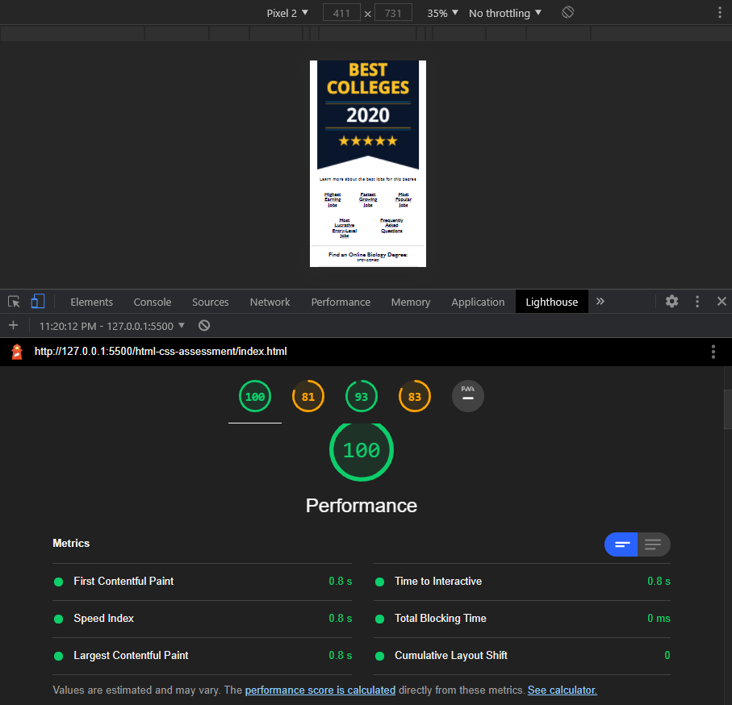
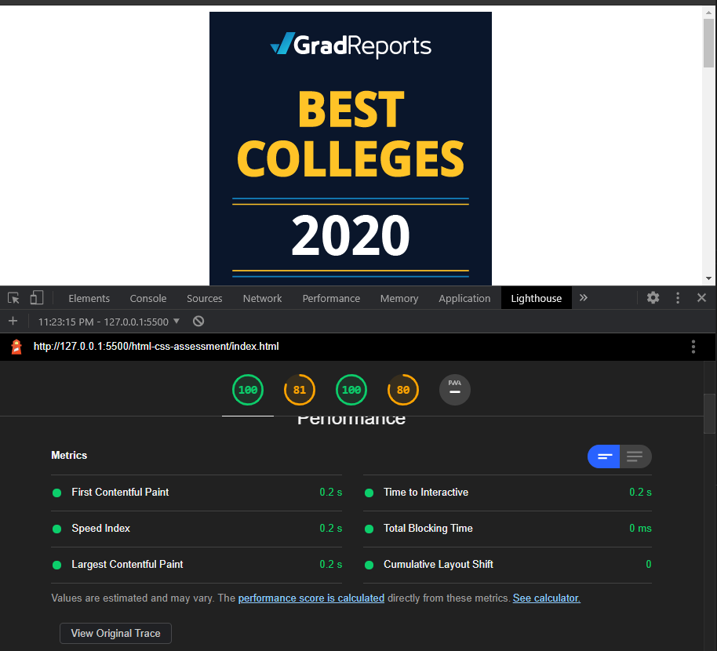

# html-css-assessment
This exercise was based on a provided [figma layout](https://www.figma.com/file/umdB9XMTbflGOHpXN1VOD6/HTML-CSS-Assessment?node-id=0%3A1) and re-created in my repo with html and css.

Assets and forked repo were provided by [Gustav Gennrich](https://github.com/ggennrich).

## Screenshots

* Mobile
    * 

* Tablet 
    * 

* Desktop 
    * 

* Mobile Lighthouse Performance
    * 

* Desktop Lighthouse Performance
    * 